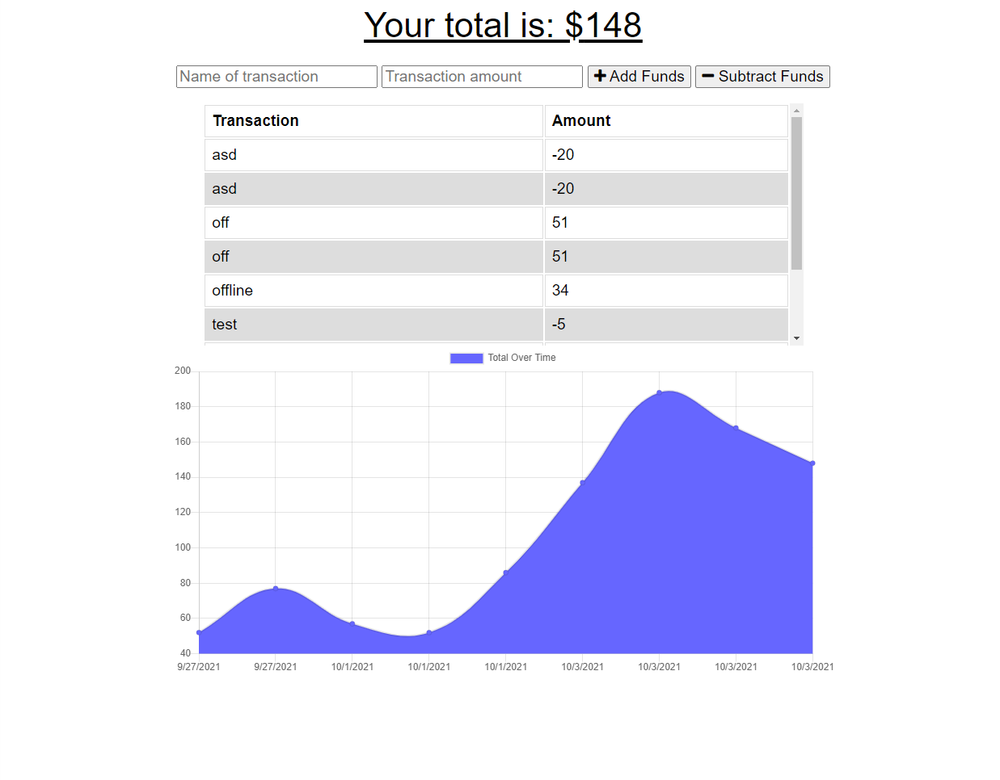

# BudgetTracker


## About Project
This web application keeps track of your budget helps helps you keep track of your spending habits. When you first open the web application you are presented with two inputs and a chart. For the inputs one of them is for the name of the transaction and the other is for the amount. When you click on the add or subtract funds is will add that data to the chart with its entry data.
## Built With
This web application was built using the following programming language, and tools. Programmed is javasricpt and used Express.js API for routing. For the database I used mongodb and mongoose. And its deployed by using Heroku.
## Installation

  Clone the repo
   ```sh
   git clon git@github.com:missile11011/BudgetTracker.git
   ```
## Contact
Misael Reyes - misaelrey@gmail.com

Project Link: [https://secure-tor-84554.herokuapp.com/](https://secure-tor-84554.herokuapp.com/)
